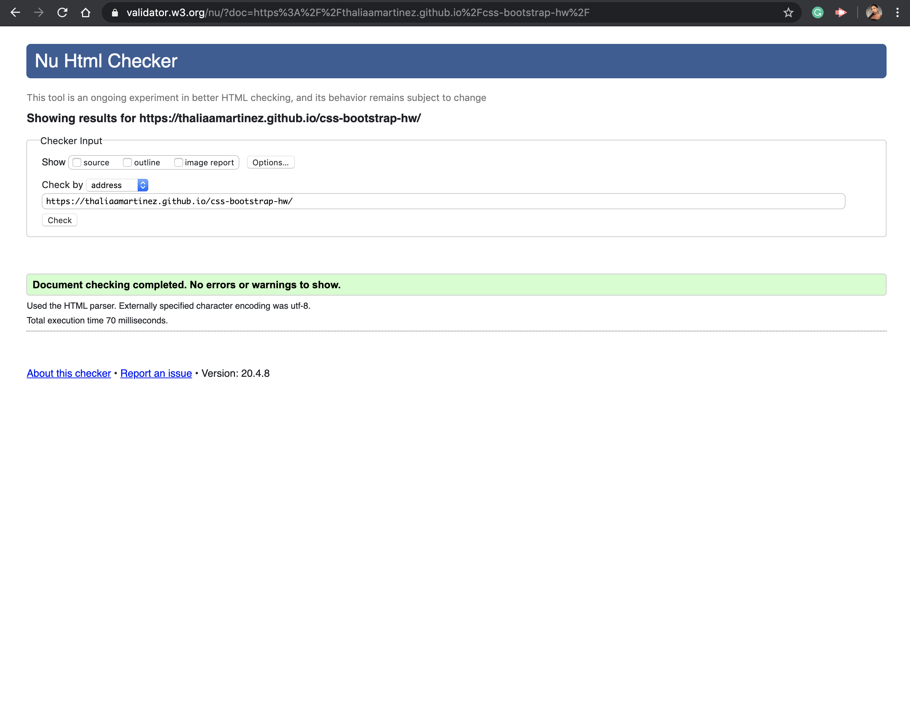

# css-bootstrap-hw
Unit 02 CSS and Bootstrap Homework: Responsive Portfolio

Using Bootstrap we were instructed to create a web application that had a responsive design inclusing responsive images and a nav bar. This application was also supposed to contain personalized information such as a biography, links to social media, and images of ourselves. It was also important to make sure the html was valid and correct. To make sure of this I used a html validation service I found online. 

Built With
Bootstrap

